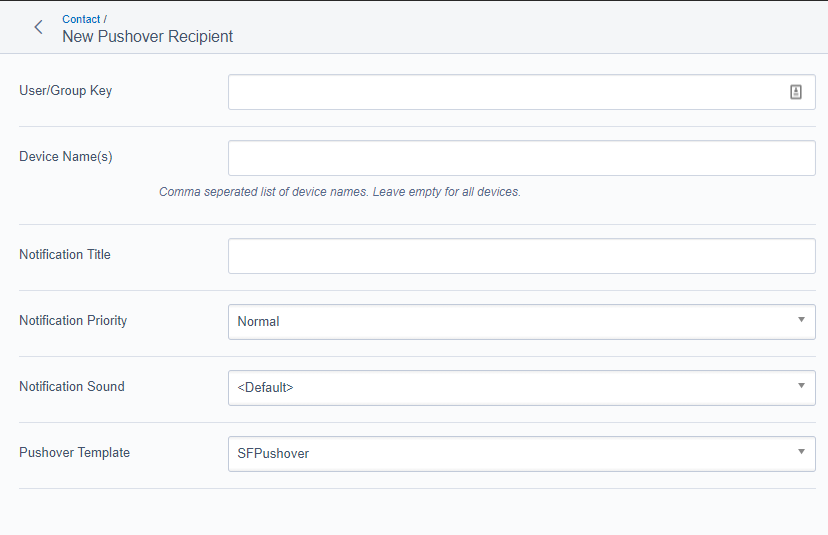

# UserForms Pushover

[](https://packagist.org/packages/stewartcossey/userforms-pushover)
[](license.md)

Extends the UserForms module to add support for sending notifications over [Pushover.net](http://www.pushover.net).



## Installation

```ssh
$ composer require stewartcossey/userforms-pushover
```

You will need to run `dev/build?flush=all` after installing this module.

This module has other dependancies that will be installed through composer. 

> Note that both the cURL and JSON PHP Extensions must be installed.

## Links

- [User Guide](docs/en/userguide.md)
- [Contributing Code](contributing.md)
- [Code License](license.md)
- [Pushover Library](https://github.com/slunak/pushover-php)
