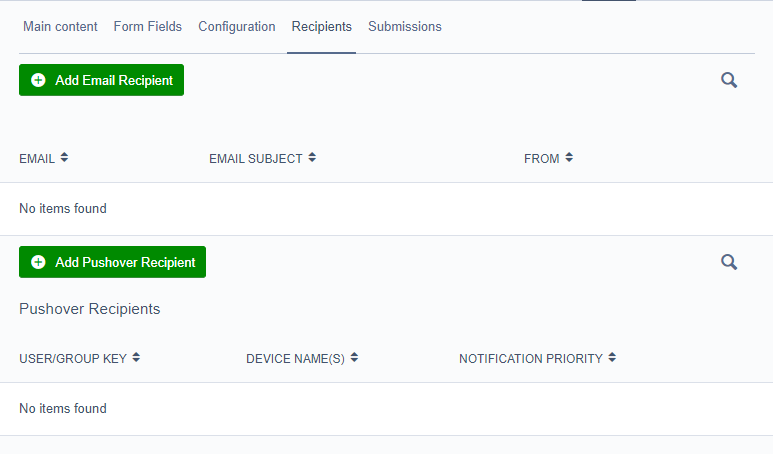

# UserForms Pushover Module

After installing, you will need to run `dev/build?flush=all`.


You must [create an Application Key](https://pushover.net/apps/build) and then update your silverstripe yaml configuration with the following:

```YAML
Pushover:
  application_key: 'aaNWYeCZhUm56RmiEwhv2grDpcVUb8'
```

## Pushover Recipients

The Pushover recipients are configured from the *Recipients* tab in the *UserDefinedForm*, beneath the *Email Recipients* grid.



You can configure multiple Pushover Recipients per *UserDefinedForm*, allowing different priority levels, sounds and templates per recipient.

## Templates

Pushover messages utilize templates just like the UserForm Emails. This works in the same way as the Email Templates and can be applied per pushover item. 

You can create your own templates, the provided templates in the `vendor/stewartcossey/userforms-pushover/templates/pushover` folder are a good place to start from. 

>Don't add templates to the vendor templates folder! Instead change the location of pushover templates via the `pushover_template_directory` setting and add your templates there. [See the example.](#Example)

The following values are available in the Pushover Template:

Name        | Description
----------- | ------------------------------------------------
$Fields     | User Form Fields
$PageTitle  | Title of Page where Form was Submitted
$UserKey    | The Pushover User/Group Key used to send message
$Devices    | The Names of Devices that were sent messages
$Sound      | The Notification Sound of the current message
$Priority   | The priority of the notification
$Title      | The title of the notification

## Configuration


Class                                        | Property                    | Type                  | Default                                              | Info
-------------------------------------------- | --------------------------- | --------------------- | ---------------------------------------------------- | ------------
Pushover                                     | application_key             | String                | None                                                 | __*Required*__ The Pushover Application API token to use when sending notifications
SilverStripe\UserForms\Model\UserDefinedForm | pushover_template_directory | String                | stewartcossey/userforms-pushover:templates/pushover/ | The pushover template directory
SilverStripe\UserForms\Model\UserDefinedForm | pushover_default_template   | String                | SubmittedFormPushover                                | The default template (without the .ss extension) for Pushover Recipients

### Example

The below configuration sets the Pushover application key along with setting the pushover message templates to the `app/templates/pushover` folder:

```YAML
Pushover:
  application_key: 'aaNWYeCZh3456RmiE44v2grDpcVUb8'

SilverStripe\UserForms\Model\UserDefinedForm:
  pushover_template_directory: 'app/templates/pushover'
```
