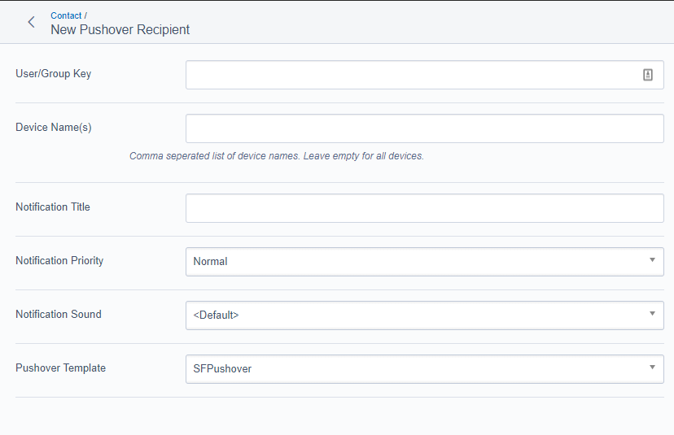

# UserForms Pushover Module

You must [create an Application Key](https://pushover.net/apps/build) and then configure your `.yml` file with the following:

Example:

```YAML
Pushover:
  application_key: 'aaNWYeCZhUm56RmiEwhv2grDpcVUb8'
```

## Pushover Recipients

The Pushover recipients are configured from the *Recipients* tab in the *UserDefinedForm*, beneath the *Email Recipients*.


You can configure multiple Pushover Recipients per *UserDefinedForm*.

## Pushover Templates

Pushover messages utilize templates just like the UserForm Emails. Templates are stored in `userforms-pushover/templates/pushover` and are applied per recipient.

The following values are available in the Pushover Template:

Name        | Description
----------- | ------------------------------------------------
$Fields     | User Form Fields
$PageTitle  | Title of Page where Form was Submitted
$UserKey    | The Pushover User/Group Key used to send message
$Devices    | The Names of Devices that were sent messages



## Configuration

The `Pushover` class in a `.yml` supports the following properties:

Property         | Type                  | Default                   | Info
---------------- | --------------------- | ------------------------- | ------------
application_key  | String                | None                      | __*Required*__ The Pushover Application API token to use when sending notifications
priority         | String *PriorityType* | *'Normal'*                | The default message Priority for Pushover Recipients
default_template | String                | *'SubmittedFormPushover'* | The default template (without the .ss extension) for Pushover Recipients

Valid *PriorityType* Values

Type         | Value
------------ | -------------
Low          | 'Low'
Lowest       | 'Lowest'
Normal       | 'Normal'
High         | 'High'
Emergency    | 'Emergency'

### Example

```YAML
Pushover:
  application_key: 'aaNWYeCZhUm56RmiEwhv2grDpcVUb8'
  priority: 'High'
  default_template: 'SubmittedFormPushoverNoPageName'
```
